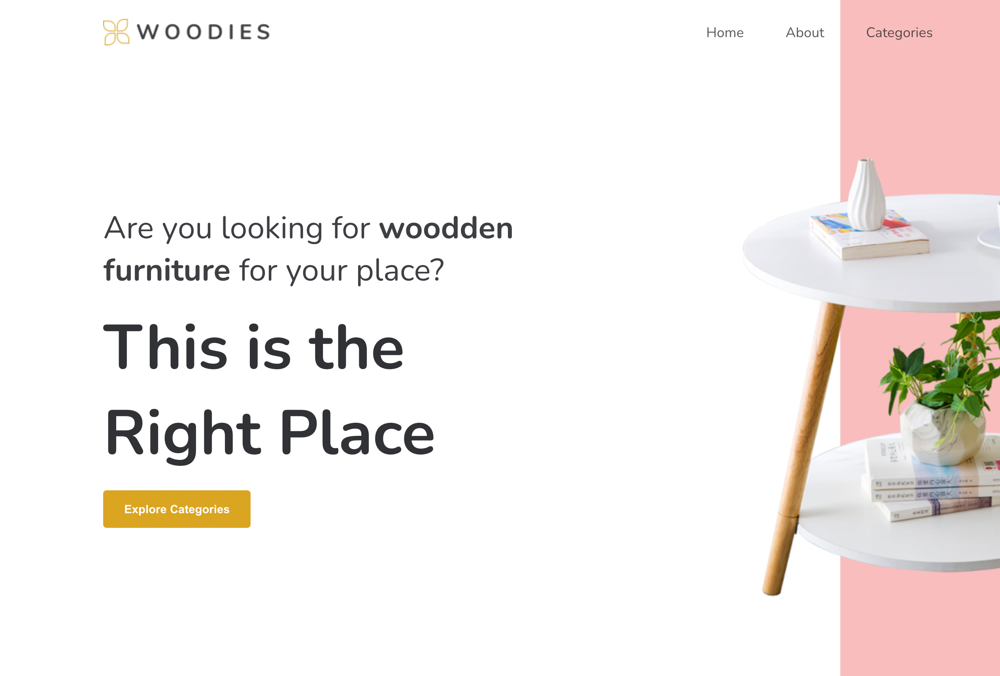

# Woodies interior site created with react

For this project, a website was created for an interior company. The following points were important:
• Use React Router to enable navigation between the different subpages.
• The project must include the following pages:

- Home
- About
- Categories
  • Jenson
  • Deon
  • Krisha

## Demo

https://cinalselin-simple-react-blog.netlify.app/

## Screenshots

